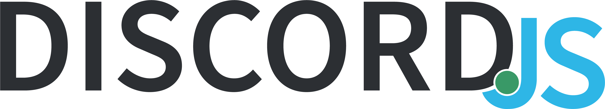

<h1 align="center">
  <br>
</a>
  <br>
  Discord.js v12 Template
  <br>
</h1>

<p align="center">
  <a href="#about">About</a>
  •
  <a href="#installation">Installation</a>
  •
  <a href="#setting-up">Setting Up</a>
  •
  <a href="#license">License</a>
  •
  <a href="#support">Support</a>
</p>

## About

A Customizable [Discord.js](https://discord.js.org/#/) v12 Template!

## Installation

Download the repo, after that open it up in vsc and in the terminal type:
```
npm install
```
## Setting Up

Open up the `config.json` and fill in the following info:
```
{
    "prefix": "",  your bot's prefix.
    "token": "",  your bot's token.
    "mongodb": "",  your mongodb url.
    "ownerid": ""  your id.
}
```
Visit Discord's [Developer Portal](https://discordapp.com/developers/applications/) create an app and then head over to `bot`, after creating a bot copy it's token and paste it on `token`.

## License

[ISC](https://opensource.org/licenses/ISC) license.

## Support

* **Discord Server** • [Link](https://discord.gg/Szt6r7Qv6P)

